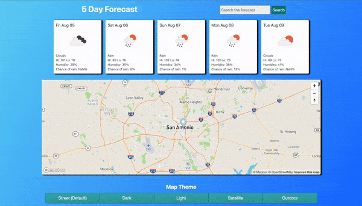

# 5 Day Forecast
<h3>Languages Used:</h3>

This application allows you to check the weather anywhere in the world with mapbox! Use the search bar to look up your desired location's weather forecast. Below the map are buttons that allow you to change the style of the map. An example of the app is shown below!
 
 

